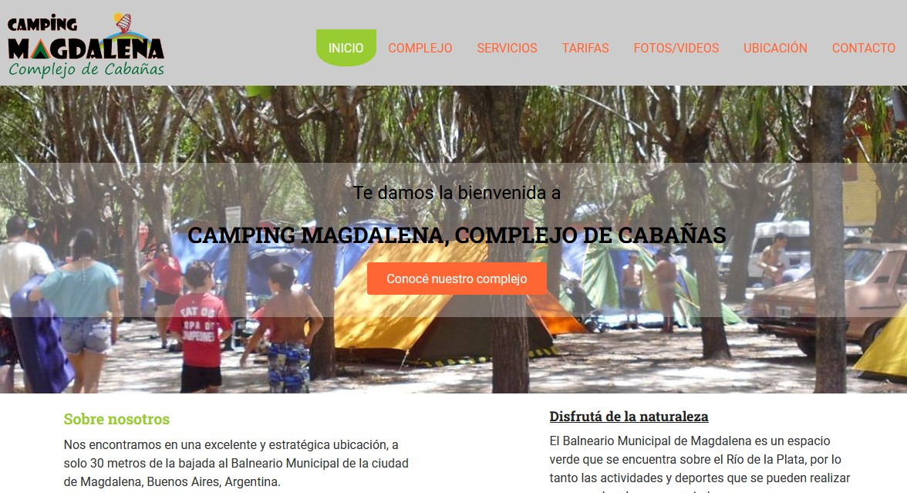

# Camping Magdalena

Proyecto de sitio web del Camping Magdalena, Complejo de Cabañas.

## Screenshot 📷

## Construido con 🛠️

* [HTML](https://developer.mozilla.org/es/docs/Web/HTML)
* [CSS](https://developer.mozilla.org/es/docs/Web/CSS)
* [JavaScript](https://developer.mozilla.org/es/docs/Learn/JavaScript)

## Autor ✒️

* **Luciano Rodríguez** - [luckidetrenque](https://github.com/luckidetrenque)

## Licencia 📄

Este proyecto está bajo la Licencia (GPL-3.0) - mira el archivo [LICENSE.md](LICENSE.md) para detalles